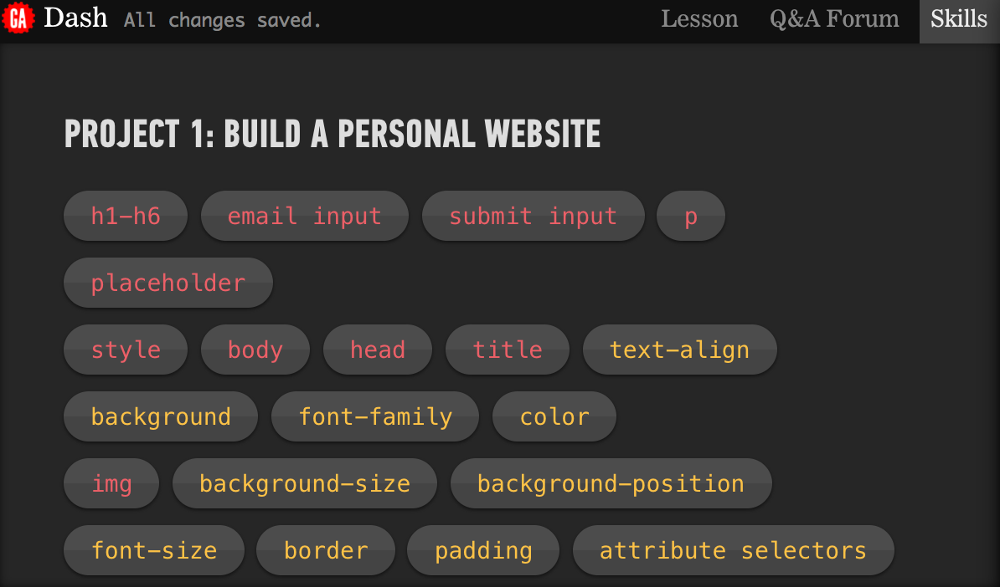

[Project 1](#project-1), [Project 2](#project-2), [Project 4](#project-4)

# Project 1 
### Learing HTML & CSS

### First, take a look at the skills tab. It may help refresh your memory on what you've learned.
 
 
 
#### Code for part 1 should look like so:
```html
<h1>Anna Dowlin</h1>
<p>Hi! I'm Anna Dowlin, a NYC-based marketer</p>
<input type="email" placeholder="Your email">
<input type="submit">
```

#### Code for part 2 should look like so:

```html
<!DOCTYPE html>
<head>
  <title>Anna Dowlin</title>
  <style>
    body {
      text-align: center;
      background: black;
      color: white;
      font-family: helvetica;
    }
    
  </style>
</head>
<body>
  <h1>Anna Dowlin</h1>
  <p>Hi! I'm Anna, a NYC-based marketer. Say hello!</p>
  <input type="email" placeholder="Your email">
  <input type="submit">
</body>
```

#### Code for part 3 should look like so:

```html
<!DOCTYPE html>
<head>
  <title>Anna Dowlin</title>
  <style>
    body {
      text-align: center;
      background: url("http://dash.ga.co/assets/anna-bg.png");
      background-size: cover;
      background-position: center;
      color: white;
      font-family: helvetica;
    }
    p {
      font-size: 22px;
    }
    input {
      border: 0;
      padding: 10px;
      font-size: 18px;
    }
    input[type="submit"] {
      background: red;
      color: white;
    }
  </style>
</head>
<body>
  
  <p>Hi! I'm Anna Dowlin, a NYC-based marketer. Say hello!</p>
  <input type="email" placeholder="Your email">
  <input type="submit">
</body>
```

#### Have a ball with part 4!


# Project 2 
### Responsive sites

# Project 4 
### CSS

 
