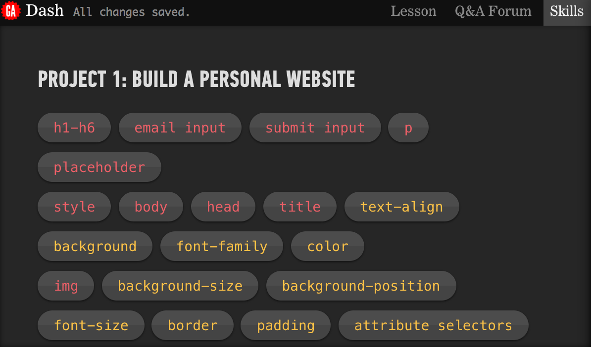

*__Quick links__*:  
[Project 1](#project-1), [Project 2](#project-2), [Project 4](#project-4)

# Project 1 
### Learning HTML & CSS

### First, take a look at the skills tab. It may help refresh your memory on what you've learned.
 
 
 
#### Code for part 1 should look like so:
```html
<h1>Anna Dowlin</h1>
<p>Hi! I'm Anna Dowlin, a NYC-based marketer</p>
<input type="email" placeholder="Your email">
<input type="submit">
```

#### Code for part 2 should look like so:

```html
<!DOCTYPE html>
<head>
  <title>Anna Dowlin</title>
  <style>
    body {
      text-align: center;
      background: black;
      color: white;
      font-family: helvetica;
    }
    
  </style>
</head>
<body>
  <h1>Anna Dowlin</h1>
  <p>Hi! I'm Anna, a NYC-based marketer. Say hello!</p>
  <input type="email" placeholder="Your email">
  <input type="submit">
</body>
```

#### Code for part 3 should look like so:

```html
<!DOCTYPE html>
<head>
  <title>Anna Dowlin</title>
  <style>
    body {
      text-align: center;
      background: url("http://dash.ga.co/assets/anna-bg.png");
      background-size: cover;
      background-position: center;
      color: white;
      font-family: helvetica;
    }
    p {
      font-size: 22px;
    }
    input {
      border: 0;
      padding: 10px;
      font-size: 18px;
    }
    input[type="submit"] {
      background: red;
      color: white;
    }
  </style>
</head>
<body>
  
  <p>Hi! I'm Anna Dowlin, a NYC-based marketer. Say hello!</p>
  <input type="email" placeholder="Your email">
  <input type="submit">
</body>
```

#### Have a ball with part 4!


# Project 2 
### Responsive sites
Don't forget to check out the skills tab if you get stuck.

#### Code for part 1 should look like so:
```html
<!DOCTYPE html>
<head>

</head>
<body>
  <header>
    
    <h1>Jeff's Blog</h1>
    <ul>
      <li><a href="#">About Me</a></li>
      <li><a href="#">Best Poems</a></li>
      <li><a href="#">Worst Poems</a></li>
    </ul>
  </header>
</body>
```

#### Code for part 2 should look like so:
```html
<!DOCTYPE html>
<head>
  <link href="/normalize.css" rel="stylesheet">
  <style>
    header{
      text-align: center;
      background: url("http://dash.ga.co/assets/jeff-bg.png");
      background-size: cover;
      color: white;
    }
    h1 {
      font-size: 70px;
    }
    img {
      margin: 40px 0px 0px 0px;
      border: 7px solid white;
      border-radius: 20px;
    }
    a {
      color: white; 
    }
    ul {
      padding: 10px;
      background: black;
    }
    li {
      display: inline;
      padding: 0px 10px 0px 10px;
    }
  </style>
</head>
<body>
  <header>
    
    <h1>Jeff's Blog</h1>
    <ul>
      <li><a href="#">About Me</a></li>
      <li><a href="#">Best Poems</a></li>
      <li><a href="#">Worst Poems</a></li>
    </ul>
  </header>
</body>
```

#### Code for part 3 should look like so:
```html
<!DOCTYPE html>
<head>
  <link href="/normalize.css" rel="stylesheet">
  <style>
    header {
      text-align: center;
      background: url('http://dash.ga.co/assets/jeff-bg.png');
      background-size: cover;
      color: white;
    }
    a {
      color: white;
    }
    h1 {
      font-size: 70px;
    }
    img {
      margin: 40px 0px 0px 0px;
      border: 7px solid white;
      border-radius: 20px;
    }
    ul {
   	   /*background: #f00;*/
      padding: 10px;
      background: rgba(0,0,0,0.5);
    }
    li {
      display: inline;
      padding: 0px 10px 0px 10px;
    }
    article {
      max-width: 500px;
      padding: 20px;
      margin: 0 auto;
    }
    @media (max-width: 500px) {
      /*body{*/
      /*  background: red;*/
      /*}*/
      h1 {
        font-size: 36px;
      }
      li {
        display: block;
        padding: 5px;
      }
    }
  </style>
</head>
<body>
  <header>
    
    <h1>Jeff's Blog</h1>
    <ul>
      <li><a href="#">About Me</a></li>
      <li><a href="#">Best Poems</a></li>
      <li><a href="#">Worst Poems</a></li>
    </ul>
  </header>
  <article>
  <h2>VHS umami pop-up trust fund</h2>
  <p>Marfa church-key kitsch bicycle rights, 8-bit mixtape cardigan gentrify Echo Park. Street art swag brunch, next level roof party Schlitz hella organic keffiyeh selfies. You probably haven't heard of them polaroid hashtag +1, meggings biodiesel Portland High Life cray tumblr retro.</p>
  <button>Like</button>
  </article>
  <article>
  <h2>Sartorial synth Echo Park, roof party</h2>
  <p>chambray you probably haven't heard of them pour-over viral selvage umami skateboard VHS post-ironic selfies. Wes Anderson gentrify fanny pack twee, bicycle rights bitters blog keffiyeh plaid flannel. Tonx irony cliche sustainable mlkshk bitters. Four loko leggings chambray Vice.</p>
  <button>Like</button>
  </article>
  <article>
  <h2>Forage food truck keytar master cleanse</h2>
  <p>ethical thundercats sustainable locavore quinoa Neutra. Aesthetic tacky sweater single-origin coffee, bicycle rights organic lo-fi street art american apparel ennui four loko ethnic Brooklyn small batch. Forage YOLO polaroid</p>
  <button>Like</button>
  </article>
<script>
  $("button").on("click", function() { 
    alert("clicked!") 
  });
</script>
</body>
```
#### Have fun with Part 4!

# Project 3 
Feel free to tackle project 3. I think project 4 is a bit more fun. You already have a great foundation of HTML & CSS!

# Project 4 
# (parts 1 & 2 only) 
### CSS

#### Code for part 1 should look like so:
```html
<!DOCTYPE html>

<head>
<style>
div {
  height: 150px;
  width: 300px;
 
  /*background: #cc5;*/
}

.foot {
  height: 40px;
  width: 40px;
  background: #ccc;
  border-radius: 40px;
  border: 15px solid #999;
  margin: 0 auto;
}
.torso {
  height: 0;
  width: 140px;
  border-top: 300px solid #bc6;
  border-left: 75px solid transparent;
  border-right: 75px solid transparent;
  margin: 0 auto;
  border-radius: 20px 20px 100px 100px;
}
.brain{
  background: radial-gradient(circle, white 15%, transparent 40%), #cc5;
  background: -webkit-radial-gradient(circle, white 15%, transparent 40%), #cc5;
  background: -moz-radial-gradient(circle, white 15%, transparent 40%), #cc5;
  background-size: 50% 100%;
  height: 150px;
  width: 150px;
  margin: 0 auto;
  border-radius: 60px 60px 10px 10px;
  border-bottom: 40px solid #666;
}
.beep{
  width: 5px;
  height: 0;
  border: 5px solid transparent;
  border-top: 10px solid #777;
  border-bottom: 80px solid #888;
  margin: 0 auto;
}

</style>
</head>

<body>
<div class="beep"></div>
<div class="brain"></div>
<div class="torso"></div>
<div class="foot"></div>

</body>
```
#### Code for part 2 should look like so:
```html
<!DOCTYPE html>

<head>
  <!--<link href="https://fonts.googleapis.com/css?family=Poller+One" rel="stylesheet" type="text/css">-->
  <link href='https://fonts.googleapis.com/css?family=Poller+One' rel='stylesheet' type='text/css'>
</head>
<style>
/*div {*/
/*  height: 150px;*/
/*  width: 300px;*/
/*  margin: 0 auto;*/
/*}*/
.robot{
  position: relative;
  left: 200px;
}
.beep{
  width: 5px;
  height: 0px;
  border: 5px solid transparent;
  border-top: 10px solid #777;
  border-bottom: 80px solid #888;
  position: relative;
  left: 140px;
}
/*@keyframes blink {
  50% {
    background: radial-gradient(circle, red 15%, transparent 40%), #cc5;
  }
}
@-webkit-keyframes blink {
  50% {
    background: -webkit-radial-gradient(circle, red 15%, transparent 40%), #cc5;
  }
}
@-moz-keyframes blink {
  50% {
    background: -moz-radial-gradient(circle, red 15%, transparent 40%), #cc5;
  }
}*/
.brain {
  animation: blink .5s infinite;
  -webkit-animation: blink .5s infinite;
  -moz-animation: blink .5s infinite;
  background: radial-gradient(circle, white 15%, transparent 40%), #cc5;
  background: -moz-radial-gradient(circle, white 15%, transparent 40%), #cc5; 
  background: -webkit-radial-gradient(circle, white 15%, transparent 40%), #cc5;
  background-size: 75px 150px;
  height: 150px;
  width: 150px;
  border-radius: 60px 60px 10px 10px;
  border-bottom: 40px solid #666;
  position: relative;
  left: 70px;
}
.torso {
  height: 0;
  width: 140px;
  border-top: 300px solid #bc6;
  border-left: 75px solid transparent;
  border-right: 75px solid transparent;
  border-radius: 20px 20px 100px 100px;
}
.left {
  font-family: 'Poller One', verdana, arial, sans-serif;
  font-weight:bold;
  font-size: 250px;
  color: #666;
  transform: rotate(200deg);
  -webkit-transform: rotate(200deg);
  -moz-transform: rotate(200deg);
  position: relative;
  left: -190px;
  top: -320px;
  z-index: -1;
}
.right {
  font-family: 'Poller One', verdana, arial, sans-serif;
  font-weight:bold;
  font-size: 250px;
  color: #666;
  transform: scaleY(-1) rotate(20deg);
  -webkit-transform: scaleY(-1) rotate(20deg);
  -moz-transform: scaleY(-1) rotate(20deg);
  position: relative;
  top: -620px;
  left: 190px;
  z-index: -1;  
}
.foot {
  height: 40px;
  width: 40px;
  background: #ccc;
  border-radius: 40px;
  border: 15px solid #999;
  position: relative;
  left: 110px;
  top: -10px;
  z-index: -1;
}
</style>

<body>
<div class="robot">
  <div class="beep"></div>
  <div class="brain"></div>
  <div class="torso">
    <div class="left">j</div>
    <div class="right">j</div>
  </div>
  <div class="foot"></div>
</div>
</body>
```

#### If you choose to conquer part 3 here is the final code:
```html
<!DOCTYPE html>

<head>
<script src="/assets/jquery.js"></script>
<link href='https://fonts.googleapis.com/css?family=Poller+One' rel='stylesheet' type='text/css'>

<style>

.robot {
  position: relative;
  left: 200px;
}

.beep {
  width: 5px;
  height: 0;
  border: 5px solid transparent;
  border-top: 10px solid #777;
  border-bottom: 80px solid #888;
  position: relative;
  left: 140px;
}
@keyframes blink {
  50% {
    background: radial-gradient(circle, red 15%, transparent 40%), #cc5;
  }
}
@-webkit-keyframes blink {
  50% {
    background: -webkit-radial-gradient(circle, red 15%, transparent 40%), #cc5;
  }
}
@-moz-keyframes blink {
  50% {
    background: -moz-radial-gradient(circle, red 15%, transparent 40%), #cc5;
  }
}

.laser{
  animation: blink .5s infinite;
  -webkit-animation: blink .5s infinite;
  -moz-animation: blink .5s infinite;
}
.brain {
  /*animation: blink .5s infinite;*/
  /*-webkit-animation: blink .5s infinite;*/
  /*-moz-animation: blink .5s infinite;*/
  background: radial-gradient(circle, white 15%, transparent 40%), #cc5;
  background: -moz-radial-gradient(circle, white 15%, transparent 40%), #cc5; 
  background: -webkit-radial-gradient(circle, white 15%, transparent 40%), #cc5;
  background-size: 75px 150px;
  height: 150px;
  width: 150px;
  border-radius: 60px 60px 10px 10px;
  border-bottom: 40px solid #666;
  position: relative;
  left: 70px;
}
.torso {
  height: 0;
  width: 140px;
  border-top: 300px solid #bc6;
  border-left: 75px solid transparent;
  border-right: 75px solid transparent;
  border-radius: 20px 20px 100px 100px;
}
.left {
  font-family: 'Poller One', verdana, arial, sans-serif;
  font-weight: bold;
  font-size: 250px;
  color: #666;
  transform: rotate(200deg);
  -webkit-transform: rotate(200deg);
  -moz-transform: rotate(200deg);
  position: relative;
  top: -320px;
  left: -190px;
  z-index: -1;
}
.right {
  font-family: 'Poller One', verdana, arial, sans-serif;
  font-weight: bold;
  font-size: 250px;
  color: #666;
  transform: scaleY(-1) rotate(20deg);
  -webkit-transform: scaleY(-1) rotate(20deg);
  -moz-transform: scaleY(-1) rotate(20deg);
  position: relative;
  top: -620px;
  left: 190px;
  z-index: -1;
}
.foot {
  height: 40px;
  width: 40px;
  background: #ccc;
  border-radius: 40px;
  border: 15px solid #999;
  position: relative;
  left: 110px;
  top: -10px;
  z-index: -1;
}
</style>
</head>

<body>

<div class="robot">
  <div class="beep"></div>
  <div class="brain"></div>
  <div class="torso">
    <div class="left">j</div>
    <div class="right">j</div>
  </div>
  <div class="foot"></div>
</div>

<button class="flash">laser eyes on/off</button>
<button class="color">change color!</button>

<script>
// When eyes button is clicked, toggle laser class
$('.flash').click(function() {
  $('.brain').toggleClass('laser');
  });

// When color button is clicked, pick a number 0-255
$(".color").click(function() {
  var red = Math.floor(Math.random() * 255);
  var green = Math.floor(Math.random() * 255);
  var blue = Math.floor(Math.random() * 255);
  // Display the number in an alert window
  alert(red + "," + green + "," + blue);
  });
</script>

</body>

```

#### If you choose to conquer part 4 here is the final code:
```html
<!DOCTYPE html>

<head>
<link href='https://fonts.googleapis.com/css?family=Poller+One' rel='stylesheet' type='text/css'>
<script src="/assets/jquery.js"></script>
<style>
body{
  background: rgba(red, green, blue, 1);
}
.robot {
  position: relative;
  left: 200px;
}

.beep {
  width: 5px;
  height: 0;
  border: 5px solid transparent;
  border-top: 10px solid #777;
  border-bottom: 80px solid #888;
  position: relative;
  left: 140px;
}

@keyframes blink {
  50% {
    background: radial-gradient(circle, red 15%, transparent 40%), #cc5;
  }
}
@-webkit-keyframes blink {
  50% {
    background: -webkit-radial-gradient(circle, red 15%, transparent 40%), #cc5;
  }
}
@-moz-keyframes blink {
  50% {
    background: -moz-radial-gradient(circle, red 15%, transparent 40%), #cc5;
  }
}
.laser {
  animation: blink .5s infinite;
  -webkit-animation: blink .5s infinite;
  -moz-animation: blink .5s infinite;
}
.brain {
  background: radial-gradient(circle, white 15%, transparent 40%), #cc5;
  background: -moz-radial-gradient(circle, white 15%, transparent 40%), #cc5; 
  background: -webkit-radial-gradient(circle, white 15%, transparent 40%), #cc5;
  background-size: 75px 150px;
  height: 150px;
  width: 150px;
  border-radius: 60px 60px 10px 10px;
  border-bottom: 40px solid #666;
  position: relative;
  left: 70px;
}
.torso {
  height: 0;
  width: 140px;
  border-top: 300px solid #bc6;
  border-left: 75px solid transparent;
  border-right: 75px solid transparent;
  border-radius: 20px 20px 100px 100px;
}
.left {
  font-family: 'Poller One', verdana, arial, sans-serif;
  font-weight: bold;
  font-size: 250px;
  color: #666;
  transform: rotate(200deg);
  -webkit-transform: rotate(200deg);
  -moz-transform: rotate(200deg);
  position: relative;
  top: -320px;
  left: -190px;
  z-index: -1;
}
.right {
  font-family: 'Poller One', verdana, arial, sans-serif;
  font-weight: bold;
  font-size: 250px;
  color: #666;
  transform: scaleY(-1) rotate(20deg);
  -webkit-transform: scaleY(-1) rotate(20deg);
  -moz-transform: scaleY(-1) rotate(20deg);
  position: relative;
  top: -620px;
  left: 190px;
  z-index: -1;
}
.foot {
  height: 40px;
  width: 40px;
  background: #ccc;
  border-radius: 40px;
  border: 15px solid #999;
  position: relative;
  left: 110px;
  top: -10px;
  z-index: -1;
}
@keyframes dance {
  from {
    left: 800px;
  }
}
@-webkit-keyframes dance {
  from {
    left: 800px;
  }
}
@-moz-keyframes dance {
  from {
    left: 800px;
  }
}
img {
  animation: dance 4s infinite;
  -webkit-animation: dance 4s infinite;
  -moz-animation: dance 4s infinite;
  position: absolute;
  top: 200px;
  left: 400px;
}
</style>
</head>

<body>

<div class="robot">
  <div class="beep"></div>
  <div class="brain"></div>
  <div class="torso">
    <div class="left">j</div>
    <div class="right">j</div>
  </div>
  <div class="foot"></div>
</div>

<button class="flash">laser eyes on/off</button>
<button class="color">change color!</button>


<button class="moves">stop the dancing!</button>

<script>
// When eyes button is clicked, toggle laser class on brain
$(".flash").click(function() {
  $(".brain").toggleClass('laser');
});

// When color button is clicked...
$(".color").click(function() {
  // assign each named color a random number 0-255
  var red = Math.floor(Math.random() * 255);
  var green = Math.floor(Math.random() * 255);
  var blue = Math.floor(Math.random() * 255);
  
  // Generate an RGBA value from red, green, and blue
  var randomRGBA = 'rgba('+red+','+green+','+blue+',1)';
  
  // and change the body's background to our random color
  $("body").css("background", randomRGBA);
  //Display the three values in an alert window
  alert(randomRGBA);
});

$(".moves").click(function() {
  $("img").toggle();
});
</script>
</body>
```
 
# Project 5 
Feel free to tackle project 5! 
At your own risk. dun. dun. dun! 

